# Charpter 1

## Stream processing
1. Sequential processing:
```java 
import static java.util.stream.Collectors.toList;
List<Apple> heavyApples =
    inventory.stream().filter((Apple a) -> a.getWeight() > 150)
                      .collect(toList());
```

2. Parallel processing:

```java 
import static java.util.stream.Collectors.toList;
List<Apple> heavyApples =
    inventory.parallelStream().filter((Apple a) -> a.getWeight() > 150)
                              .collect(toList());
```

## Passing code to methods with behavior parameterization

```java
File[] hiddenFiles = new File(".").listFiles(File::isHidden);
```

Functions are first-class values; remember how methods can be passed as functional values and how anonymous functions (lambdas)            are written.

## Parallelism and shared mutable data

Multicore processors aren’t fully served by existing Java programming practice

## DEFAULT METHODS

The Java 8 solution is to break the last link—an interface can now contain method signatures for which an implementing class         doesn’t provide an implementation! So who implements them? The missing method bodies are given as part of the interface (hence         default implementations) rather than in the implementing class.                  
This provides a way for an interface designer to enlarge an interface beyond those methods that were originally planned—without         breaking existing code. Java 8 uses the new default keyword in the interface specification to achieve this.

For example, in Java 8 you can now call the sort method directly on a List. This is made possible with the following default method in the Java 8 List interface, which calls the static method Collections.sort:

```java
default void sort(Comparator<? super E> c) {
    Collections.sort(this, c);
}
```

# Chapter 2
                                     
## Behavior parameterization   

We call this a predicate (that is, a function that returns a boolean)    

```java
    public static List<Apple> filter(List<Apple> inventory, ApplePredicate p){
		List<Apple> result = new ArrayList<>();
		for(Apple apple : inventory){
			if(p.test(apple)){
				result.add(apple);
			}
		}
		return result;
	}       

	interface ApplePredicate{
		public boolean test(Apple a);
	}

	static class AppleWeightPredicate implements ApplePredicate{
		public boolean test(Apple apple){
			return apple.getWeight() > 150; 
		}
	}
	static class AppleColorPredicate implements ApplePredicate{
		public boolean test(Apple apple){
			return "green".equals(apple.getColor());
		}
	}

	static class AppleRedAndHeavyPredicate implements ApplePredicate{
		public boolean test(Apple apple){
			return "red".equals(apple.getColor()) 
					&& apple.getWeight() > 150; 
		}
	}
```                                
## Anonymous classes       
Anonymous classes are often used in the context of GUI applications to create event-handler objects

```java
button.setOnAction(new EventHandler<ActionEvent>() {    public void handle(ActionEvent event) {        System.out.println("Woooo a click!!");    }});
```

Ideally we’d like to encourage programmers to use the behavior parameterization pattern, because as you’ve just seen, it makes         your code more adaptive to requirement changes. 


Preview of lambda expressions    
```java
List<Apple> result =  filterApples(inventory, (Apple apple) -> "red".equals(apple.getColor()));
```                                   
## Real-world examples: Comparator, Runnable, and GUI

1. Sorting with a Comparator

```java
// java.util.Comparator
public interface Comparator<T> {
    public int compare(T o1, T o2);
}

inventory.sort(new Comparator<Apple>() {
     public int compare(Apple a1, Apple a2){
          return a1.getWeight().compareTo(a2.getWeight());
     }
});

inventory.sort(
  (Apple a1, Apple a2) -> a1.getWeight().compareTo(a2.getWeight()));

```

2. Executing a block of code with Runnable

```java
Thread t = new Thread(() -> System.out.println("Hello world"));
```

3. GUI event handling
```java
button.setOnAction((ActionEvent event) -> label.setText("Sent!!"));
```

# Chapter 3

## Lambdas in a nutshell

A lambda expression can be understood as a concise representation of an anonymous function that can be passed around: it doesn’t have a name,         but it has a list of parameters, a body, a return type, and also possibly a list of exceptions that can be thrown. That’s         one big definition; let’s break it down:                                          
* Anonymous— We say anonymous because it doesn’t have an explicit name like a method would normally have: less to write and think about!                                       
* Function— We say function because a lambda isn’t associated with a particular class like a method is. But like a method, a lambda has a list of parameters,            a body, a return type, and a possible list of exceptions that can be thrown.                                       
* Passed around— A lambda expression can be passed as argument to a method or stored in a variable.                                       
* Concise— You don’t need to write a lot of boilerplate like you do for anonymous classes.

The lambda we just showed you has three parts  

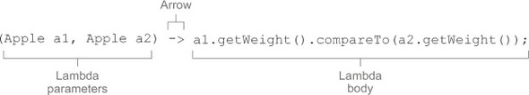

* A list of parameters— In this case it mirrors the parameters of the compare method of a Comparator—two Apples.                                       
* An arrow— The arrow -> separates the list of parameters from the body of the lambda.                                       
* The body of the lambda— Compare two Apples using their weights. The expression is considered the lambda’s return value.

The basic syntax of a lambda is either

```java
(parameters) -> expression
```
or

```java
(parameters) -> { statements; }
```
| Use case  | Examples of lambdas                     | 
|-----------|--------------------------------------------------------| 
| A boolean expression  | A boolean expression	(List<String> list) -> list.isEmpty() | 
| Creating objects | () -> new Apple(10)                  | 
| Consuming from an object | (Apple a) -> {System.out.printlna.getWeight());}              | | Select/extract from an object |  (String s) -> s.length()           | 
| Combine two values | (int a, int b) -> a * b               | 
| Compare two objects | (Apple a1, Apple a2) -> a1.getWeight().compareTo(a2.getWeight()) | 
## Where and how to use lambdas   
* Functional interface

A functional interface is an interface that specifies exactly one abstract method.


| Functional interface  | Function descriptor                     | Primitive pecializations|
|-----------|--------------------------------------------------------| --------------------------------------------------------| 
| Predicate<T>  | T -> boolean |IntPredicate, LongPredicate, DoublePredicate |
| Consumer<T> | T -> void                  | IntConsumer, LongConsumer, DoubleConsumer|
| Function<T, R> | T -> R              | IntFunction<R>, IntToDoubleFunction, IntToLongFunction, LongFunction<R>, LongToDoubleFunction, LongToIntFunction, DoubleFunction<R>, ToIntFunction<T>, ToDoubleFunction<T>, ToLongFunction<T>|
| Supplier<T> | () -> T                  | BooleanSupplier, IntSupplier, LongSupplier, DoubleSupplier|
| UnaryOperator<T> | T -> T                 | IntUnaryOperator, LongUnaryOperator, DoubleUnaryOperator|
| BinaryOperator<T>|(T, T) -> T|IntBinaryOperator, LongBinaryOperator, DoubleBinaryOperator|
| BiPredicate<L, R> | BiPredicate<L, R>	(L, R) -> boolean               | |
| BiConsumer<T, U>| (T, U) -> void                 | ObjIntConsumer<T>, ObjLongConsumer<T>, ObjDoubleConsumer<T>|
| BiFunction<T, U, R> | (T, U) -> R                | ToIntBiFunction<T, U>, ToLongBiFunction<T, U>, ToDoubleBiFunction<T, U>|


## The execute around pattern   

1. define one functional interface and use it as parameter
2. pass Lamdar expression.
3. in this example, we could also use Function<T, R> as parameter, then we don't need to define functional interface.

```java
	public static void main(String ...args) throws IOException{

        // method we want to refactor to make more flexible
        String result = processFileLimited();
        System.out.println(result);

        System.out.println("---");
// handle one line once.
		String oneLine = processFile((BufferedReader b) -> b.readLine());
		System.out.println(oneLine);
// handle two lines one time
		String twoLines = processFile((BufferedReader b) -> b.readLine() + b.readLine());
		System.out.println(twoLines);

	}

    public static String processFileLimited() throws IOException {
        try (BufferedReader br =
                     new BufferedReader(new FileReader("lambdasinaction/chap3/data.txt"))) {
            return br.readLine();
        }
    }


	public static String processFile(BufferedReaderProcessor p) throws IOException {
		try(BufferedReader br = new BufferedReader(new FileReader("lambdasinaction/chap3/data.txt"))){
			return p.process(br);
		}

	}

	public interface BufferedReaderProcessor{
		public String process(BufferedReader b) throws IOException;

	}
```

## Functional interfaces, type inference    
* Predicate
```java
@FunctionalInterface
public interface Predicate<T>{
    boolean test(T t);
}

public static <T> List<T> filter(List<T> list, Predicate<T> p) {
    List<T> results = new ArrayList<>();
    for(T s: list){
        if(p.test(s)){
            results.add(s);
        }
    }
    return results;
}

Predicate<String> nonEmptyStringPredicate = (String s) -> !s.isEmpty();
List<String> nonEmpty = filter(listOfStrings, nonEmptyStringPredicate);
```

* Consumer

The java.util.function.Consumer<T> interface defines an abstract method named **accept** that takes an object of generic type T and returns no result (void).

* Function

The java.util.function.Function<T, R> interface defines an abstract method named **apply** that takes an object of generic type T as input and returns an object of generic type R. 

As a result, in Java there’s a mechanism to convert a primitive type into a corresponding reference type. This mechanism         is called _boxing_. The opposite approach (that is, converting a reference type into a corresponding primitive type) is called _unboxing_.

Java 8 brings a specialized version of the functional interfaces we described earlier in order to avoid autoboxing operations         when the inputs or outputs are primitives. 

| Use case  | Example of lambda              | Matching functional interface|
|-----------|--------------------------------------------------------| --------------------------------------------------------| 
| A boolean expression  | (List<String> list) -> list.isEmpty() |Predicate<List<String>>|
|Creating objects  | () -> new Apple(10) |Supplier<Apple>|
| Consuming from an object | (Apple a) -> System.out.println(a.getWeight()) |Consumer<Apple>|
| Select/extract from an object  | (String s) -> s.length() |Function<String, Integer> or ToIntFunction<String>|
| Combine two values  | (int a, int b) -> a * b |IntBinaryOperator|
| Compare two objects  |  objects	(Apple a1, Apple a2) -> a1.getWeight().compareTo (a2.getWeight()) |Comparator<Apple> or BiFunction<Apple, Apple, Integer> or ToIntBiFunction<Apple, Apple>|


If a lambda has a statement expression as its body, it’s compatible with a function descriptor that returns void (provided the parameter list is compatible too). 

```java
// Predicate has a boolean return
Predicate<String> p = s -> list.add(s);
// Consumer has a void return
Consumer<String> b = s -> list.add(s);
```

* Using local variables

Lambdas are allowed         to capture (that is, to reference in their bodies) instance variables and static variables without restrictions. But local         variables have to be explicitly declared final or are effectively final. In other words, lambda expressions can capture local variables that are assigned to them only once. 

## Method references  

Apple::getWeight is a method reference to the method getWeight defined in the Apple class. Remember that no brackets are needed because you’re not actually calling the method. The method reference is shorthand for the lambda expression (Apple a) -> a.getWeight().

| Lambda  | Examples of lambdas                     | 
|-----------|--------------------------------------------------------| 
|(Apple a) -> a.getWeight()|	Apple::getWeight|
|() -> Thread.currentThread().dumpStack()|	Thread.currentThread()::dumpStack|
|(str, i) -> str.substring(i)|	String::substring|
|(String s) -> System.out.println(s)|	System.out::println|


There are three main kinds of method references:


1.  A method reference to a static method (for example, the method parseInt of Integer, written Integer::parseInt)

2.  A method reference to an instance method of an arbitrary type (for example, the method length of a String, written String::length)

3.  A method reference to an instance method of an existing object (for example, suppose you have a local variable expensiveTransaction that holds an object of type Transaction, which supports an instance method getValue; you can write expensiveTransaction::getValue)

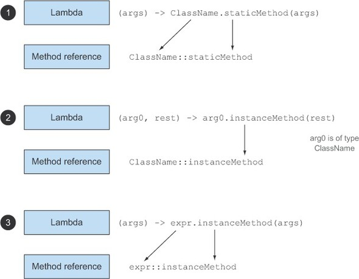

```java
List<String> str = Arrays.asList("a","b","A","B");
str.sort((s1, s2) -> s1.compareToIgnoreCase(s2));

List<String> str = Arrays.asList("a","b","A","B");
str.sort(String::compareToIgnoreCase);
```

In practice

```java
    import static java.util.Comparator.comparing;

        inventory.sort((a1, a2) -> a1.getWeight().compareTo(a2.getWeight()));
        System.out.println(inventory);
        
        // reshuffling things a little
        inventory.set(1, new Apple(10, "red"));
        
        // 4
        // [Apple{color='red', weight=10}, Apple{color='red', weight=20}, Apple{color='green', weight=155}]
        inventory.sort(comparing(Apple::getWeight));
        System.out.println(inventory);       
```

## Composing lambdas

Functional interfaces such as Comparator, Predicate, and Function have several default methods that can be used to combine lambda expressions

* Composing Comparators
```java
Comparator<Apple> c = Comparator.comparing(Apple::getWeight);
//reverse order
inventory.sort(comparing(Apple::getWeight).reversed());
// second comparator
inventory.sort(comparing(Apple::getWeight).reversed().thenComparing(Apple::getCountry));
```
* Composing Predicates

The Predicate interface includes three methods that let you reuse an existing Predicate to create more complicated ones: **negate**, **and**, and **or**.

Note that the precedence of methods and and or is managed from left to right using their positions in the chain. So a.or(b).and(c) can be seen as (a || b) && c.

* Composing Functions

The Function interface comes with two default methods for this, **andThen** and **compose**, which both return an instance of Function.

The method andThen returns a function that first applies a given function to an input and then applies another function to the result of that application.

f.andThen(g) - >  g(f(x))
f.compose(g) - > f(g(x))

```java
public class Letter {
	public static String addHeader(String text) {
		return "From Raoul, Mario and Alan: " + text;
	}

	public static String addFooter(String text) {
		return text + " Kind regards";
	}

	public static String checkSpelling(String text) {
		return text.replaceAll("labda", "lambda");
	}
}

// first pipeline
Function<String, String> addHeader = Letter::addHeader;
Function<String, String> transformationPipeline  = addHeader.andThen(Letter::checkSpelling)             .andThen(Letter::addFooter);

//second pipeline
Function<String, String> addHeader = Letter::addHeader;Function<String, String> transformationPipeline  = addHeader.andThen(Letter::addFooter);

```

# Introducing streams

Streams consume from a data-providing source such as collections, arrays, or I/O resources. Note that generating a stream            from an ordered collection preserves the ordering. The elements of a stream coming from a list will have the same order as            the list.

* Pipelining— Many stream operations return a stream themselves, allowing operations to be chained and form a larger pipeline. This enables            certain optimizations that we explain in the next chapter, such as laziness and short-circuiting. A pipeline of operations can be viewed as a database-like query on the data source.                 

* Internal iteration— In contrast to collections, which are iterated explicitly using an iterator, stream operations do the iteration behind the            scenes for you. Using an internal iteration, the processing         of items could be transparently done in parallel or in a different order that may be more optimized

Collect as an operation that takes as an argument various recipes for accumulating the elements of a stream into a summary result.

So keep in mind that you can consume a stream **only once**!

## STREAM OPERATIONS

You can see two groups of operations:     

1. filter, map, and limit can be connected together to form a pipeline. 
2. collect causes the pipeline to be **executed** and closes it.

Intermediate operations such as filter or sorted return another stream as the return type. This allows the operations to be connected to form a query. What’s important is         that intermediate operations **don’t perform any processing** until a terminal operation is invoked on the stream pipeline—they’re         lazy. 

Terminal operations produce a result from a stream pipeline. A result is any nonstream value such as a List, an Integer, or even void. 


**Operation**|**Type**|**Return type**|**Argument of the operation**|**Function descriptor**
:-----:|:-----:|:-----:|:-----:|:-----:
filter|Intermediate|Stream<T>|Predicate<T>|T -> boolean
map|Intermediate|Stream<R>|Function<T, R>|T -> R
limit|Intermediate|Stream<T>| | 
sorted|Intermediate|Stream<T>|Comparator<T>|(T, T) -> int
distinct|Intermediate|Stream<T>| | 


Terminal operation.

* For each  
Consumes each element from a stream and applies a lambda to each of them. The operation returns void.
* Count  
Returns the number of elements in a stream. The operation returns a long
* collect  
Reduces the stream to create a collection such as a List, a Map, or even an Integer. See chapter 6 for more detail.

# Chapter 5. Working with streams

## FILTERING AND SLICING

```java
        List<Dish> vegetarianMenu =
            menu.stream()
                .filter(Dish::isVegetarian)
                .collect(toList());

        vegetarianMenu.forEach(System.out::println);

        // Filtering unique elements
        List<Integer> numbers = Arrays.asList(1, 2, 1, 3, 3, 2, 4);
        numbers.stream()
               .filter(i -> i % 2 == 0)
               .distinct()
               .forEach(System.out::println);
        // Truncating a stream
        List<Dish> dishesLimit3 =
            menu.stream()
                .filter(d -> d.getCalories() > 300)
                .limit(3)
                .collect(toList());

        dishesLimit3.forEach(System.out::println);

        // Skipping elements
        List<Dish> dishesSkip2 =
            menu.stream()
                .filter(d -> d.getCalories() > 300)
                .skip(2)
                .collect(toList());

        dishesSkip2.forEach(System.out::println);

```

## MAPPING


There’s a method called Arrays.stream()that takes an array and produces a stream. This is always used in the flatMap.

the flatMap method lets you replace each value of a stream with another stream and then concatenates all the generated streams into a         single stream.

```java
import static java.util.stream.Collectors.toList;
// map
        List<String> dishNames = menu.stream()
                                     .map(Dish::getName)
                                     .collect(toList());
        System.out.println(dishNames);

        // map
        List<String> words = Arrays.asList("Hello", "World");
        List<Integer> wordLengths = words.stream()
                                         .map(String::length)
                                         .collect(toList());
        System.out.println(wordLengths);

        // flatMap
        words.stream()
                 .flatMap((String line) -> Arrays.stream(line.split("")))
                 .distinct()
                 .forEach(System.out::println);

        // flatMap, this could be used like database join.
        List<Integer> numbers1 = Arrays.asList(1,2,3,4,5);
        List<Integer> numbers2 = Arrays.asList(6,7,8);
        List<int[]> pairs =
                        numbers1.stream()
                                .flatMap((Integer i) -> numbers2.stream()
                                                       .map((Integer j) -> new int[]{i, j})
                                 )
                                .filter(pair -> (pair[0] + pair[1]) % 3 == 0)
                                .collect(toList());
        pairs.forEach(pair -> System.out.println("(" + pair[0] + ", " + pair[1] + ")"));
```

##  FINDING AND MATCHING

These three operations, anyMatch, allMatch, and noneMatch, make use of what we call short-circuiting

The findAny method returns an arbitrary element of the current stream. It can be used in conjunction with other stream operations. 
```java

public class Finding{

    public static void main(String...args){
        if(isVegetarianFriendlyMenu()){
            System.out.println("Vegetarian friendly");
        }

        System.out.println(isHealthyMenu());
        System.out.println(isHealthyMenu2());
        
        Optional<Dish> dish = findVegetarianDish();
        dish.ifPresent(d -> System.out.println(d.getName()));
    }
    
    private static boolean isVegetarianFriendlyMenu(){
        return menu.stream().anyMatch(Dish::isVegetarian);
    }
    
    private static boolean isHealthyMenu(){
        return menu.stream().allMatch(d -> d.getCalories() < 1000);
    }
    
    private static boolean isHealthyMenu2(){
        return menu.stream().noneMatch(d -> d.getCalories() >= 1000);
    }
    
    private static Optional<Dish> findVegetarianDish(){
        return menu.stream().filter(Dish::isVegetarian).findAny();
    }
    
}

```

You may wonder why we have both **findFirst** and **findAny**. The answer is parallelism. Finding the first element is more constraining in parallel. If you don’t care about which element            is returned, use findAny because it’s less constraining when using parallel streams.

## REDUCING

### Summing the elements

```java
int sum = numbers.stream().reduce(0, (a, b) -> a + b);
```

reduce takes two arguments:                                          
1. An initial value, here 0.
2. A BinaryOperator<T> to combine two elements and produce a new value; here you use the lambda (a, b) -> a + b.
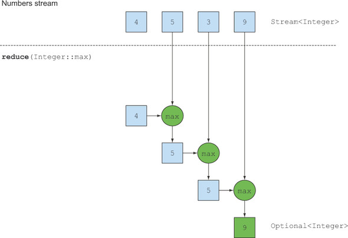
There’s also an overloaded variant of reduce that doesn’t take an initial value, but it returns an Optional object:
```java
Optional<Integer> sum = numbers.stream().reduce((a, b) -> (a + b));
Optional<Integer> max = numbers.stream().reduce(Integer::max);
Optional<Integer> min = numbers.stream().reduce(Integer::min);
```
Consider the case when the stream contains no elements.

## Numeric streams
you’ll use to convert a stream to a specialized version are mapToInt, mapToDouble, and mapToLong. 
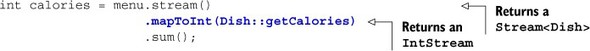
IntStream also supports other convenience methods such as max, min, and average.

To convert from a primitive stream to a general stream (each int will be boxed to an Integer) you can use the method boxed as follows:
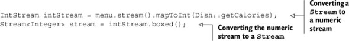

## Numeric ranges

Java 8 introduces two static methods available on IntStream and LongStream to help generate such ranges: range and rangeClosed.

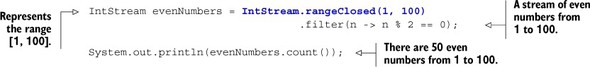

In practice.
```java
Stream<int[]> pythagoreanTriples =    IntStream.rangeClosed(1, 100).boxed()             .flatMap(a ->                IntStream.rangeClosed(a, 100)                         .filter(b -> Math.sqrt(a*a + b*b) % 1 == 0)                         .mapToObj(b ->                            new int[]{a, b, (int)Math.sqrt(a * a + b * b)})                     );
```


## Building streams

### Streams from values
```java
Stream<String> stream = Stream.of("Java 8 ", "Lambdas ", "In ", "Action");
stream.map(String::toUpperCase).forEach(System.out::println);
Stream<String> emptyStream = Stream.empty();
```

### Streams from arrays
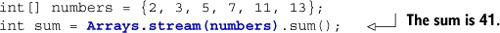

### Streams from files
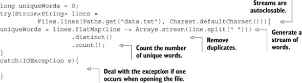

## Streams from functions: creating infinite streams!
The Streams API provides two static methods to generate a stream from a function: Stream.iterate and Stream.generate. These two operations let you create what we call an infinite stream: a stream that doesn’t have a fixed size like when you create a stream from a fixed collection. Streams produced by iterate and generate create values on demand given a function and can therefore calculate values forever! It’s generally sensible to use limit(n) on such streams to avoid printing an infinite number of values.

### Iterate
```java
Stream.iterate(0, n -> n + 2)
      .limit(10)
      .forEach(System.out::println);
```

In general, you should use iterate when you need to produce a sequence of successive values

### Generate
Similarly to the method iterate, the method generate lets you produce an infinite stream of values computed on demand. But generate doesn’t apply successively a function on each new produced value. It takes a lambda of type Supplier<T> to provide new values. 

### Iterate
```java
Stream.generate(Math::random)
      .limit(5)
      .forEach(System.out::println);

IntStream ones = IntStream.generate(() -> 1);
```

## Summary
Some operations such as filter and map are stateless; they don’t store any state. Some operations such as reduce store state to calculate a value. Some operations such as sorted and distinct also store state because they need to buffer all the elements of a stream before returning a new stream. Such operations            are called stateful operations.

# Chapter 6. Collecting data with streams

Collectors class. These offer three main functionalities:

1. Reducing and summarizing stream elements to a single value
2. Grouping elements
3. Partitioning elements

## REDUCING AND SUMMARIZING

```java
import static java.util.stream.Collectors.*;

Comparator<Dish> dishCaloriesComparator =
    Comparator.comparingInt(Dish::getCalories);

Optional<Dish> mostCalorieDish =
    menu.stream()
        .collect(maxBy(dishCaloriesComparator));

int totalCalories = menu.stream().collect(summingInt(Dish::getCalories));

IntSummaryStatistics menuStatistics =
        menu.stream().collect(summarizingInt(Dish::getCalories));
```

you can count the elements in the menu and obtain the sum, average, maximum, and minimum of the calories contained in each dish with a single summarizing operation 

IntSummaryStatistics{count=9, sum=4300, min=120,
                     average=477.777778, max=800}

## Joining Strings

**joining** factory method concatenates into a single string all strings resulting from invoking the toString method

```java
String shortMenu = menu.stream().map(Dish::getName).collect(joining());

String shortMenu = menu.stream().map(Dish::getName).collect(joining(", "));
```

## Reducing 

```java
int totalCalories = menu.stream().collect(reducing(                                   0, Dish::getCalories, (i, j) -> i + j));
```

1. The first argument is the starting value of the reduction operation and will also be the value returned in the case of a stream with no elements, so clearly 0 is the appropriate value in the case of a numeric sum.
2. The second argument is the same function you used in section 6.2.2 to transform a dish into an int representing its calorie content.
3. The third argument is a BinaryOperator that aggregates two items into a single value of the same type. Here, it just sums two ints.

Similarly, you could find the highest-calorie dish using the one-argument version of reducing as follows:

```java
Optional<Dish> mostCalorieDish =
    menu.stream().collect(reducing(
        (d1, d2) -> d1.getCalories() > d2.getCalories() ? d1 : d2));
```

You can think of the collector created with the one-argument reducing factory method as a particular case of the three-argument method, which uses the first item in the stream as a starting point and an identity function (that is, a function doing nothing more than returning its input argument as is) as a transformation function. 

## Collect vs. reduce
This solution has two problems: a semantic one and a practical one. The semantic problem lies in the fact that the reduce method is meant to combine two values and produce a new one; it’s an immutable reduction. In contrast, the collect method is designed to mutate a container to accumulate the result it’s supposed to produce.

This is the main reason why the collect method is useful for expressing reduction working on a mutable container but crucially in a parallel-friendly way

## GROUPING

```java
Map<Dish.Type, List<Dish>> dishesByType = menu.stream().collect(groupingBy(Dish::getType));

public enum CaloricLevel { DIET, NORMAL, FAT }

Map<CaloricLevel, List<Dish>> dishesByCaloricLevel = menu.stream().collect( groupingBy(dish -> {                
    if (dish.getCalories() <= 400) return CaloricLevel.DIET;              else if (dish.getCalories() <= 700) return    CaloricLevel.NORMAL; 
    else return CaloricLevel.FAT;         
    } ));
```

So to perform a two-level grouping, you can pass an inner groupingBy to the outer groupingBy, defining a second-level criterion to classify the stream’s items,

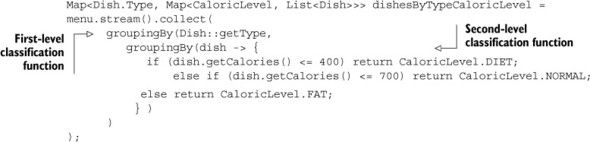

### Collecting data in subgroups
more generally, the second collector passed to the first         groupingBy can be any type of collector, not just another groupingBy. For instance, it’s possible to count the number of Dishes in the menu for each type, by passing the counting collector as a second argument to the groupingBy collector

```java
Map<Dish.Type, Long> typesCount = menu.stream().collect(                    groupingBy(Dish::getType, counting()));
```

groupingBy(f), where f is the classification function, is in reality just shorthand for groupingBy(f, toList())

To give another example, you could rework the collector you already used to find the highest-calorie dish in the menu to achieve         a similar result, but now classified by the type of dish:

```java
Map<Dish.Type, Optional<Dish>> mostCaloricByType = menu.stream().collect(groupingBy(Dish::getType, maxBy(comparingInt(Dish::getCalories))));
```

More generally, the collector passed as second argument to the groupingBy factory method will be used to perform a further reduction operation on all the elements in the stream classified into the same group.

```java
Map<Dish.Type, Integer> totalCaloriesByType =
               menu.stream().collect(groupingBy(Dish::getType,
                        summingInt(Dish::getCalories)));
```

the **mapping** method. This method takes two arguments: a function transforming the elements in a stream and a further collector accumulating         the objects resulting from this transformation. Its purpose is to adapt a collector accepting elements of a given type to         one working on objects of a different type, by applying a mapping function to each input element before accumulating them.

```java
Map<Dish.Type, Set<CaloricLevel>> caloricLevelsByType =menu.stream().collect(   groupingBy(Dish::getType, mapping(    dish -> { if (dish.getCalories() <= 400) return CaloricLevel.DIET;            else if (dish.getCalories() <= 700) return CaloricLevel.NORMAL;          else return CaloricLevel.FAT; },    toSet() )));
```

But by using toCollection, you can have more control. For example, you can ask for a HashSet by passing a constructor reference to it:
```java
Map<Dish.Type, Set<CaloricLevel>> caloricLevelsByType =menu.stream().collect(   groupingBy(Dish::getType, mapping(    dish -> { if (dish.getCalories() <= 400) return CaloricLevel.DIET;            else if (dish.getCalories() <= 700) return CaloricLevel.NORMAL;          else return CaloricLevel.FAT; },    toCollection(HashSet::new) )));
```
## PARTITIONING

Partitioning is a special case of grouping: having a predicate (a function returning a boolean), called a partitioning function, as a classification function. 

## Collector interface

Stream has an overloaded collect method accepting the three other functions—supplier, accumulator, and combiner
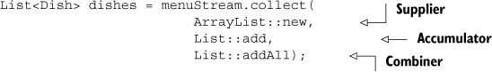

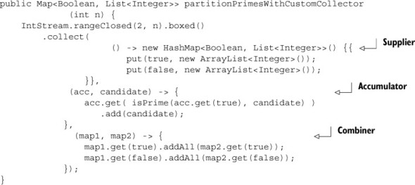

## SUMMARY

* various recipes (called collectors) for accumulating the elements of a stream            into a summary result.    
* Predefined collectors include reducing and summarizing stream elements into a single value, such as calculating the minimum,            maximum, or average. Those collectors are summarized in table 6.1.  
* Predefined collectors let you group elements of a stream with groupingBy and partition elements of a stream with partitioningBy. 
* Collectors compose effectively to create multilevel groupings, partitions, and reductions.           
* You can develop your own collectors by implementing the methods defined in the Collector interface

