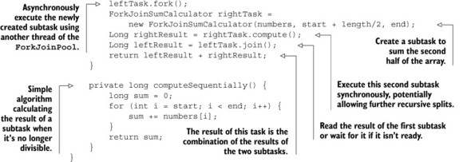

# Charpter 1

## Stream processing
1. Sequential processing:
```java 
import static java.util.stream.Collectors.toList;
List<Apple> heavyApples =
    inventory.stream().filter((Apple a) -> a.getWeight() > 150)
                      .collect(toList());
```

2. Parallel processing:

```java 
import static java.util.stream.Collectors.toList;
List<Apple> heavyApples =
    inventory.parallelStream().filter((Apple a) -> a.getWeight() > 150)
                              .collect(toList());
```

## Passing code to methods with behavior parameterization

```java
File[] hiddenFiles = new File(".").listFiles(File::isHidden);
```

Functions are first-class values; remember how methods can be passed as functional values and how anonymous functions (lambdas)            are written.

## Parallelism and shared mutable data

Multicore processors aren’t fully served by existing Java programming practice

## DEFAULT METHODS

The Java 8 solution is to break the last link—an interface can now contain method signatures for which an implementing class         doesn’t provide an implementation! So who implements them? The missing method bodies are given as part of the interface (hence         default implementations) rather than in the implementing class.                  
This provides a way for an interface designer to enlarge an interface beyond those methods that were originally planned—without         breaking existing code. Java 8 uses the new default keyword in the interface specification to achieve this.

For example, in Java 8 you can now call the sort method directly on a List. This is made possible with the following default method in the Java 8 List interface, which calls the static method Collections.sort:

```java
default void sort(Comparator<? super E> c) {
    Collections.sort(this, c);
}
```

# Chapter 2
                                     
## Behavior parameterization   

We call this a predicate (that is, a function that returns a boolean)    

```java
    public static List<Apple> filter(List<Apple> inventory, ApplePredicate p){
		List<Apple> result = new ArrayList<>();
		for(Apple apple : inventory){
			if(p.test(apple)){
				result.add(apple);
			}
		}
		return result;
	}       

	interface ApplePredicate{
		public boolean test(Apple a);
	}

	static class AppleWeightPredicate implements ApplePredicate{
		public boolean test(Apple apple){
			return apple.getWeight() > 150; 
		}
	}
	static class AppleColorPredicate implements ApplePredicate{
		public boolean test(Apple apple){
			return "green".equals(apple.getColor());
		}
	}

	static class AppleRedAndHeavyPredicate implements ApplePredicate{
		public boolean test(Apple apple){
			return "red".equals(apple.getColor()) 
					&& apple.getWeight() > 150; 
		}
	}
```                                
## Anonymous classes       
Anonymous classes are often used in the context of GUI applications to create event-handler objects

```java
button.setOnAction(new EventHandler<ActionEvent>() {    public void handle(ActionEvent event) {        System.out.println("Woooo a click!!");    }});
```

Ideally we’d like to encourage programmers to use the behavior parameterization pattern, because as you’ve just seen, it makes         your code more adaptive to requirement changes. 


Preview of lambda expressions    
```java
List<Apple> result =  filterApples(inventory, (Apple apple) -> "red".equals(apple.getColor()));
```                                   
## Real-world examples: Comparator, Runnable, and GUI

1. Sorting with a Comparator

```java
// java.util.Comparator
public interface Comparator<T> {
    public int compare(T o1, T o2);
}

inventory.sort(new Comparator<Apple>() {
     public int compare(Apple a1, Apple a2){
          return a1.getWeight().compareTo(a2.getWeight());
     }
});

inventory.sort(
  (Apple a1, Apple a2) -> a1.getWeight().compareTo(a2.getWeight()));

```

2. Executing a block of code with Runnable

```java
Thread t = new Thread(() -> System.out.println("Hello world"));
```

3. GUI event handling
```java
button.setOnAction((ActionEvent event) -> label.setText("Sent!!"));
```

# Chapter 3

## Lambdas in a nutshell

A lambda expression can be understood as a concise representation of an anonymous function that can be passed around: it doesn’t have a name,         but it has a list of parameters, a body, a return type, and also possibly a list of exceptions that can be thrown. That’s         one big definition; let’s break it down:                                          
* Anonymous— We say anonymous because it doesn’t have an explicit name like a method would normally have: less to write and think about!                                       
* Function— We say function because a lambda isn’t associated with a particular class like a method is. But like a method, a lambda has a list of parameters,            a body, a return type, and a possible list of exceptions that can be thrown.                                       
* Passed around— A lambda expression can be passed as argument to a method or stored in a variable.                                       
* Concise— You don’t need to write a lot of boilerplate like you do for anonymous classes.

The lambda we just showed you has three parts  


* A list of parameters— In this case it mirrors the parameters of the compare method of a Comparator—two Apples.                                       
* An arrow— The arrow -> separates the list of parameters from the body of the lambda.                                       
* The body of the lambda— Compare two Apples using their weights. The expression is considered the lambda’s return value.

The basic syntax of a lambda is either

```java
(parameters) -> expression
```
or

```java
(parameters) -> { statements; }
```
| Use case  | Examples of lambdas                     | 
|-----------|--------------------------------------------------------| 
| A boolean expression  | A boolean expression	(List<String> list) -> list.isEmpty() | 
| Creating objects | () -> new Apple(10)                  | 
| Consuming from an object | (Apple a) -> {System.out.printlna.getWeight());}              | | Select/extract from an object |  (String s) -> s.length()           | 
| Combine two values | (int a, int b) -> a * b               | 
| Compare two objects | (Apple a1, Apple a2) -> a1.getWeight().compareTo(a2.getWeight()) | 
## Where and how to use lambdas   
* Functional interface

A functional interface is an interface that specifies exactly one abstract method.


| Functional interface  | Function descriptor                     | Primitive pecializations|
|-----------|--------------------------------------------------------| --------------------------------------------------------| 
| Predicate<T>  | T -> boolean |IntPredicate, LongPredicate, DoublePredicate |
| Consumer<T> | T -> void                  | IntConsumer, LongConsumer, DoubleConsumer|
| Function<T, R> | T -> R              | IntFunction<R>, IntToDoubleFunction, IntToLongFunction, LongFunction<R>, LongToDoubleFunction, LongToIntFunction, DoubleFunction<R>, ToIntFunction<T>, ToDoubleFunction<T>, ToLongFunction<T>|
| Supplier<T> | () -> T                  | BooleanSupplier, IntSupplier, LongSupplier, DoubleSupplier|
| UnaryOperator<T> | T -> T                 | IntUnaryOperator, LongUnaryOperator, DoubleUnaryOperator|
| BinaryOperator<T>|(T, T) -> T|IntBinaryOperator, LongBinaryOperator, DoubleBinaryOperator|
| BiPredicate<L, R> | BiPredicate<L, R>	(L, R) -> boolean               | |
| BiConsumer<T, U>| (T, U) -> void                 | ObjIntConsumer<T>, ObjLongConsumer<T>, ObjDoubleConsumer<T>|
| BiFunction<T, U, R> | (T, U) -> R                | ToIntBiFunction<T, U>, ToLongBiFunction<T, U>, ToDoubleBiFunction<T, U>|


## The execute around pattern   

1. define one functional interface and use it as parameter
2. pass Lamdar expression.
3. in this example, we could also use Function<T, R> as parameter, then we don't need to define functional interface.

```java
	public static void main(String ...args) throws IOException{

        // method we want to refactor to make more flexible
        String result = processFileLimited();
        System.out.println(result);

        System.out.println("---");
// handle one line once.
		String oneLine = processFile((BufferedReader b) -> b.readLine());
		System.out.println(oneLine);
// handle two lines one time
		String twoLines = processFile((BufferedReader b) -> b.readLine() + b.readLine());
		System.out.println(twoLines);

	}

    public static String processFileLimited() throws IOException {
        try (BufferedReader br =
                     new BufferedReader(new FileReader("lambdasinaction/chap3/data.txt"))) {
            return br.readLine();
        }
    }


	public static String processFile(BufferedReaderProcessor p) throws IOException {
		try(BufferedReader br = new BufferedReader(new FileReader("lambdasinaction/chap3/data.txt"))){
			return p.process(br);
		}

	}

	public interface BufferedReaderProcessor{
		public String process(BufferedReader b) throws IOException;

	}
```

## Functional interfaces, type inference    
* Predicate
```java
@FunctionalInterface
public interface Predicate<T>{
    boolean test(T t);
}

public static <T> List<T> filter(List<T> list, Predicate<T> p) {
    List<T> results = new ArrayList<>();
    for(T s: list){
        if(p.test(s)){
            results.add(s);
        }
    }
    return results;
}

Predicate<String> nonEmptyStringPredicate = (String s) -> !s.isEmpty();
List<String> nonEmpty = filter(listOfStrings, nonEmptyStringPredicate);
```

* Consumer

The java.util.function.Consumer<T> interface defines an abstract method named **accept** that takes an object of generic type T and returns no result (void).

* Function

The java.util.function.Function<T, R> interface defines an abstract method named **apply** that takes an object of generic type T as input and returns an object of generic type R. 

As a result, in Java there’s a mechanism to convert a primitive type into a corresponding reference type. This mechanism         is called _boxing_. The opposite approach (that is, converting a reference type into a corresponding primitive type) is called _unboxing_.

Java 8 brings a specialized version of the functional interfaces we described earlier in order to avoid autoboxing operations         when the inputs or outputs are primitives. 

| Use case  | Example of lambda              | Matching functional interface|
|-----------|--------------------------------------------------------| --------------------------------------------------------| 
| A boolean expression  | (List<String> list) -> list.isEmpty() |Predicate<List<String>>|
|Creating objects  | () -> new Apple(10) |Supplier<Apple>|
| Consuming from an object | (Apple a) -> System.out.println(a.getWeight()) |Consumer<Apple>|
| Select/extract from an object  | (String s) -> s.length() |Function<String, Integer> or ToIntFunction<String>|
| Combine two values  | (int a, int b) -> a * b |IntBinaryOperator|
| Compare two objects  |  objects	(Apple a1, Apple a2) -> a1.getWeight().compareTo (a2.getWeight()) |Comparator<Apple> or BiFunction<Apple, Apple, Integer> or ToIntBiFunction<Apple, Apple>|


If a lambda has a statement expression as its body, it’s compatible with a function descriptor that returns void (provided the parameter list is compatible too). 

```java
// Predicate has a boolean return
Predicate<String> p = s -> list.add(s);
// Consumer has a void return
Consumer<String> b = s -> list.add(s);
```

* Using local variables

Lambdas are allowed         to capture (that is, to reference in their bodies) instance variables and static variables without restrictions. But local         variables have to be explicitly declared final or are effectively final. In other words, lambda expressions can capture local variables that are assigned to them only once. 

## Method references  

Apple::getWeight is a method reference to the method getWeight defined in the Apple class. Remember that no brackets are needed because you’re not actually calling the method. The method reference is shorthand for the lambda expression (Apple a) -> a.getWeight().

| Lambda  | Examples of lambdas                     | 
|-----------|--------------------------------------------------------| 
|(Apple a) -> a.getWeight()|	Apple::getWeight|
|() -> Thread.currentThread().dumpStack()|	Thread.currentThread()::dumpStack|
|(str, i) -> str.substring(i)|	String::substring|
|(String s) -> System.out.println(s)|	System.out::println|


There are three main kinds of method references:


1.  A method reference to a static method (for example, the method parseInt of Integer, written Integer::parseInt)

2.  A method reference to an instance method of an arbitrary type (for example, the method length of a String, written String::length)

3.  A method reference to an instance method of an existing object (for example, suppose you have a local variable expensiveTransaction that holds an object of type Transaction, which supports an instance method getValue; you can write expensiveTransaction::getValue)


```java
List<String> str = Arrays.asList("a","b","A","B");
str.sort((s1, s2) -> s1.compareToIgnoreCase(s2));

List<String> str = Arrays.asList("a","b","A","B");
str.sort(String::compareToIgnoreCase);
```

## In practice

```java
    import static java.util.Comparator.comparing;

        inventory.sort((a1, a2) -> a1.getWeight().compareTo(a2.getWeight()));
        System.out.println(inventory);
        
        // reshuffling things a little
        inventory.set(1, new Apple(10, "red"));
        
        // 4
        // [Apple{color='red', weight=10}, Apple{color='red', weight=20}, Apple{color='green', weight=155}]
        inventory.sort(comparing(Apple::getWeight));
        System.out.println(inventory);       
```

## Composing lambdas

Functional interfaces such as Comparator, Predicate, and Function have several default methods that can be used to combine lambda expressions

* Composing Comparators
```java
Comparator<Apple> c = Comparator.comparing(Apple::getWeight);
//reverse order
inventory.sort(comparing(Apple::getWeight).reversed());
// second comparator
inventory.sort(comparing(Apple::getWeight).reversed().thenComparing(Apple::getCountry));
```
* Composing Predicates

The Predicate interface includes three methods that let you reuse an existing Predicate to create more complicated ones: **negate**, **and**, and **or**.

Note that the precedence of methods and and or is managed from left to right using their positions in the chain. So a.or(b).and(c) can be seen as (a || b) && c.

* Composing Functions

The Function interface comes with two default methods for this, **andThen** and **compose**, which both return an instance of Function.

The method andThen returns a function that first applies a given function to an input and then applies another function to the result of that application.

f.andThen(g) - >  g(f(x))
f.compose(g) - > f(g(x))

```java
public class Letter {
	public static String addHeader(String text) {
		return "From Raoul, Mario and Alan: " + text;
	}

	public static String addFooter(String text) {
		return text + " Kind regards";
	}

	public static String checkSpelling(String text) {
		return text.replaceAll("labda", "lambda");
	}
}

// first pipeline
Function<String, String> addHeader = Letter::addHeader;
Function<String, String> transformationPipeline  = addHeader.andThen(Letter::checkSpelling)             .andThen(Letter::addFooter);

//second pipeline
Function<String, String> addHeader = Letter::addHeader;Function<String, String> transformationPipeline  = addHeader.andThen(Letter::addFooter);

```

# Introducing streams

Streams consume from a data-providing source such as collections, arrays, or I/O resources. Note that generating a stream            from an ordered collection preserves the ordering. The elements of a stream coming from a list will have the same order as            the list.

* Pipelining— Many stream operations return a stream themselves, allowing operations to be chained and form a larger pipeline. This enables            certain optimizations that we explain in the next chapter, such as laziness and short-circuiting. A pipeline of operations can be viewed as a database-like query on the data source.                 

* Internal iteration— In contrast to collections, which are iterated explicitly using an iterator, stream operations do the iteration behind the            scenes for you. Using an internal iteration, the processing         of items could be transparently done in parallel or in a different order that may be more optimized

Collect as an operation that takes as an argument various recipes for accumulating the elements of a stream into a summary result.

So keep in mind that you can consume a stream **only once**!

## STREAM OPERATIONS

You can see two groups of operations:     

1. filter, map, and limit can be connected together to form a pipeline. 
2. collect causes the pipeline to be **executed** and closes it.

Intermediate operations such as filter or sorted return another stream as the return type. This allows the operations to be connected to form a query. What’s important is         that intermediate operations **don’t perform any processing** until a terminal operation is invoked on the stream pipeline—they’re         lazy. 

Terminal operations produce a result from a stream pipeline. A result is any nonstream value such as a List, an Integer, or even void. 


**Operation**|**Type**|**Return type**|**Argument of the operation**|**Function descriptor**
:-----:|:-----:|:-----:|:-----:|:-----:
filter|Intermediate|Stream<T>|Predicate<T>|T -> boolean
map|Intermediate|Stream<R>|Function<T, R>|T -> R
limit|Intermediate|Stream<T>| | 
sorted|Intermediate|Stream<T>|Comparator<T>|(T, T) -> int
distinct|Intermediate|Stream<T>| | 


Terminal operation.

* For each  
Consumes each element from a stream and applies a lambda to each of them. The operation returns void.
* Count  
Returns the number of elements in a stream. The operation returns a long
* collect  
Reduces the stream to create a collection such as a List, a Map, or even an Integer. See chapter 6 for more detail.

# Chapter 5. Working with streams

## FILTERING AND SLICING

```java
        List<Dish> vegetarianMenu =
            menu.stream()
                .filter(Dish::isVegetarian)
                .collect(toList());

        vegetarianMenu.forEach(System.out::println);

        // Filtering unique elements
        List<Integer> numbers = Arrays.asList(1, 2, 1, 3, 3, 2, 4);
        numbers.stream()
               .filter(i -> i % 2 == 0)
               .distinct()
               .forEach(System.out::println);
        // Truncating a stream
        List<Dish> dishesLimit3 =
            menu.stream()
                .filter(d -> d.getCalories() > 300)
                .limit(3)
                .collect(toList());

        dishesLimit3.forEach(System.out::println);

        // Skipping elements
        List<Dish> dishesSkip2 =
            menu.stream()
                .filter(d -> d.getCalories() > 300)
                .skip(2)
                .collect(toList());

        dishesSkip2.forEach(System.out::println);

```

## MAPPING


There’s a method called Arrays.stream()that takes an array and produces a stream. This is always used in the flatMap.

the flatMap method lets you replace each value of a stream with another stream and then concatenates all the generated streams into a         single stream.

```java
import static java.util.stream.Collectors.toList;
// map
        List<String> dishNames = menu.stream()
                                     .map(Dish::getName)
                                     .collect(toList());
        System.out.println(dishNames);

        // map
        List<String> words = Arrays.asList("Hello", "World");
        List<Integer> wordLengths = words.stream()
                                         .map(String::length)
                                         .collect(toList());
        System.out.println(wordLengths);

        // flatMap
        words.stream()
                 .flatMap((String line) -> Arrays.stream(line.split("")))
                 .distinct()
                 .forEach(System.out::println);

        // flatMap, this could be used like database join.
        List<Integer> numbers1 = Arrays.asList(1,2,3,4,5);
        List<Integer> numbers2 = Arrays.asList(6,7,8);
        List<int[]> pairs =
                        numbers1.stream()
                                .flatMap((Integer i) -> numbers2.stream()
                                                       .map((Integer j) -> new int[]{i, j})
                                 )
                                .filter(pair -> (pair[0] + pair[1]) % 3 == 0)
                                .collect(toList());
        pairs.forEach(pair -> System.out.println("(" + pair[0] + ", " + pair[1] + ")"));
```

##  FINDING AND MATCHING

These three operations, anyMatch, allMatch, and noneMatch, make use of what we call short-circuiting

The findAny method returns an arbitrary element of the current stream. It can be used in conjunction with other stream operations. 
```java

public class Finding{

    public static void main(String...args){
        if(isVegetarianFriendlyMenu()){
            System.out.println("Vegetarian friendly");
        }

        System.out.println(isHealthyMenu());
        System.out.println(isHealthyMenu2());
        
        Optional<Dish> dish = findVegetarianDish();
        dish.ifPresent(d -> System.out.println(d.getName()));
    }
    
    private static boolean isVegetarianFriendlyMenu(){
        return menu.stream().anyMatch(Dish::isVegetarian);
    }
    
    private static boolean isHealthyMenu(){
        return menu.stream().allMatch(d -> d.getCalories() < 1000);
    }
    
    private static boolean isHealthyMenu2(){
        return menu.stream().noneMatch(d -> d.getCalories() >= 1000);
    }
    
    private static Optional<Dish> findVegetarianDish(){
        return menu.stream().filter(Dish::isVegetarian).findAny();
    }
    
}

```

You may wonder why we have both **findFirst** and **findAny**. The answer is parallelism. Finding the first element is more constraining in parallel. If you don’t care about which element            is returned, use findAny because it’s less constraining when using parallel streams.

## REDUCING

### Summing the elements

```java
int sum = numbers.stream().reduce(0, (a, b) -> a + b);
```

reduce takes two arguments:                                          
1. An initial value, here 0.
2. A BinaryOperator<T> to combine two elements and produce a new value; here you use the lambda (a, b) -> a + b.

There’s also an overloaded variant of reduce that doesn’t take an initial value, but it returns an Optional object:
```java
Optional<Integer> sum = numbers.stream().reduce((a, b) -> (a + b));
Optional<Integer> max = numbers.stream().reduce(Integer::max);
Optional<Integer> min = numbers.stream().reduce(Integer::min);
```
Consider the case when the stream contains no elements.

## Numeric streams
you’ll use to convert a stream to a specialized version are mapToInt, mapToDouble, and mapToLong. 

IntStream also supports other convenience methods such as max, min, and average.

To convert from a primitive stream to a general stream (each int will be boxed to an Integer) you can use the method boxed as follows:


## Numeric ranges

Java 8 introduces two static methods available on IntStream and LongStream to help generate such ranges: range and rangeClosed.


In practice.
```java
Stream<int[]> pythagoreanTriples =    IntStream.rangeClosed(1, 100).boxed()             .flatMap(a ->                IntStream.rangeClosed(a, 100)                         .filter(b -> Math.sqrt(a*a + b*b) % 1 == 0)                         .mapToObj(b ->                            new int[]{a, b, (int)Math.sqrt(a * a + b * b)})                     );
```


## Building streams

### Streams from values
```java
Stream<String> stream = Stream.of("Java 8 ", "Lambdas ", "In ", "Action");
stream.map(String::toUpperCase).forEach(System.out::println);
Stream<String> emptyStream = Stream.empty();
```

### Streams from arrays


### Streams from files


## Streams from functions: creating infinite streams!
The Streams API provides two static methods to generate a stream from a function: Stream.iterate and Stream.generate. These two operations let you create what we call an infinite stream: a stream that doesn’t have a fixed size like when you create a stream from a fixed collection. Streams produced by iterate and generate create values on demand given a function and can therefore calculate values forever! It’s generally sensible to use limit(n) on such streams to avoid printing an infinite number of values.

### Iterate
```java
Stream.iterate(0, n -> n + 2)
      .limit(10)
      .forEach(System.out::println);
```

In general, you should use iterate when you need to produce a sequence of successive values

### Generate
Similarly to the method iterate, the method generate lets you produce an infinite stream of values computed on demand. But generate doesn’t apply successively a function on each new produced value. It takes a lambda of type Supplier<T> to provide new values. 

### Iterate
```java
Stream.generate(Math::random)
      .limit(5)
      .forEach(System.out::println);

IntStream ones = IntStream.generate(() -> 1);
```

## Summary
Some operations such as filter and map are stateless; they don’t store any state. Some operations such as reduce store state to calculate a value. Some operations such as sorted and distinct also store state because they need to buffer all the elements of a stream before returning a new stream. Such operations            are called stateful operations.

# Chapter 6. Collecting data with streams

Collectors class. These offer three main functionalities:

1. Reducing and summarizing stream elements to a single value
2. Grouping elements
3. Partitioning elements

## REDUCING AND SUMMARIZING

```java
import static java.util.stream.Collectors.*;

Comparator<Dish> dishCaloriesComparator =
    Comparator.comparingInt(Dish::getCalories);

Optional<Dish> mostCalorieDish =
    menu.stream()
        .collect(maxBy(dishCaloriesComparator));

int totalCalories = menu.stream().collect(summingInt(Dish::getCalories));

IntSummaryStatistics menuStatistics =
        menu.stream().collect(summarizingInt(Dish::getCalories));
```

you can count the elements in the menu and obtain the sum, average, maximum, and minimum of the calories contained in each dish with a single summarizing operation 

IntSummaryStatistics{count=9, sum=4300, min=120,
                     average=477.777778, max=800}

## Joining Strings

**joining** factory method concatenates into a single string all strings resulting from invoking the toString method

```java
String shortMenu = menu.stream().map(Dish::getName).collect(joining());

String shortMenu = menu.stream().map(Dish::getName).collect(joining(", "));
```

## Reducing 

```java
int totalCalories = menu.stream().collect(reducing(                                   0, Dish::getCalories, (i, j) -> i + j));
```

1. The first argument is the starting value of the reduction operation and will also be the value returned in the case of a stream with no elements, so clearly 0 is the appropriate value in the case of a numeric sum.
2. The second argument is the same function you used in section 6.2.2 to transform a dish into an int representing its calorie content.
3. The third argument is a BinaryOperator that aggregates two items into a single value of the same type. Here, it just sums two ints.

Similarly, you could find the highest-calorie dish using the one-argument version of reducing as follows:

```java
Optional<Dish> mostCalorieDish =
    menu.stream().collect(reducing(
        (d1, d2) -> d1.getCalories() > d2.getCalories() ? d1 : d2));
```

You can think of the collector created with the one-argument reducing factory method as a particular case of the three-argument method, which uses the first item in the stream as a starting point and an identity function (that is, a function doing nothing more than returning its input argument as is) as a transformation function. 

## Collect vs. reduce
This solution has two problems: a semantic one and a practical one. The semantic problem lies in the fact that the reduce method is meant to combine two values and produce a new one; it’s an immutable reduction. In contrast, the collect method is designed to mutate a container to accumulate the result it’s supposed to produce.

This is the main reason why the collect method is useful for expressing reduction working on a mutable container but crucially in a parallel-friendly way

## GROUPING

```java
Map<Dish.Type, List<Dish>> dishesByType = menu.stream().collect(groupingBy(Dish::getType));

public enum CaloricLevel { DIET, NORMAL, FAT }

Map<CaloricLevel, List<Dish>> dishesByCaloricLevel = menu.stream().collect( groupingBy(dish -> {                
    if (dish.getCalories() <= 400) return CaloricLevel.DIET;              else if (dish.getCalories() <= 700) return    CaloricLevel.NORMAL; 
    else return CaloricLevel.FAT;         
    } ));
```

So to perform a two-level grouping, you can pass an inner groupingBy to the outer groupingBy, defining a second-level criterion to classify the stream’s items,


### Collecting data in subgroups
more generally, the second collector passed to the first         groupingBy can be any type of collector, not just another groupingBy. For instance, it’s possible to count the number of Dishes in the menu for each type, by passing the counting collector as a second argument to the groupingBy collector

```java
Map<Dish.Type, Long> typesCount = menu.stream().collect(                    groupingBy(Dish::getType, counting()));
```

groupingBy(f), where f is the classification function, is in reality just shorthand for groupingBy(f, toList())

To give another example, you could rework the collector you already used to find the highest-calorie dish in the menu to achieve         a similar result, but now classified by the type of dish:

```java
Map<Dish.Type, Optional<Dish>> mostCaloricByType = menu.stream().collect(groupingBy(Dish::getType, maxBy(comparingInt(Dish::getCalories))));
```

More generally, the collector passed as second argument to the groupingBy factory method will be used to perform a further reduction operation on all the elements in the stream classified into the same group.

```java
Map<Dish.Type, Integer> totalCaloriesByType =
               menu.stream().collect(groupingBy(Dish::getType,
                        summingInt(Dish::getCalories)));
```

the **mapping** method. This method takes two arguments: a function transforming the elements in a stream and a further collector accumulating         the objects resulting from this transformation. Its purpose is to adapt a collector accepting elements of a given type to         one working on objects of a different type, by applying a mapping function to each input element before accumulating them.

```java
Map<Dish.Type, Set<CaloricLevel>> caloricLevelsByType =menu.stream().collect(   groupingBy(Dish::getType, mapping(    dish -> { if (dish.getCalories() <= 400) return CaloricLevel.DIET;            else if (dish.getCalories() <= 700) return CaloricLevel.NORMAL;          else return CaloricLevel.FAT; },    toSet() )));
```

But by using toCollection, you can have more control. For example, you can ask for a HashSet by passing a constructor reference to it:
```java
Map<Dish.Type, Set<CaloricLevel>> caloricLevelsByType =menu.stream().collect(   groupingBy(Dish::getType, mapping(    dish -> { if (dish.getCalories() <= 400) return CaloricLevel.DIET;            else if (dish.getCalories() <= 700) return CaloricLevel.NORMAL;          else return CaloricLevel.FAT; },    toCollection(HashSet::new) )));
```
## PARTITIONING

Partitioning is a special case of grouping: having a predicate (a function returning a boolean), called a partitioning function, as a classification function. 

## Collector interface

Stream has an overloaded collect method accepting the three other functions—supplier, accumulator, and combiner


## SUMMARY

* various recipes (called collectors) for accumulating the elements of a stream            into a summary result.    
* Predefined collectors include reducing and summarizing stream elements into a single value, such as calculating the minimum,            maximum, or average. Those collectors are summarized in table 6.1.  
* Predefined collectors let you group elements of a stream with groupingBy and partition elements of a stream with partitioningBy. 
* Collectors compose effectively to create multilevel groupings, partitions, and reductions.           
* You can develop your own collectors by implementing the methods defined in the Collector interface


# Chapter 7. Parallel data processing and performance

## PARALLEL STREAMS

### Turning a sequential stream into a parallel one


 Note that you might think that you could achieve finer-grained control over which operations you want to perform in         parallel and which one sequentially while traversing the stream by combining these two methods.
 But the last call to parallel or sequential wins and affects the pipeline globally. In this example, the pipeline will be executed in parallel because that’s the last         call in the pipeline.

 Parallel streams internally use the default ForkJoinPool (you’ll learn more about the fork/join framework in section 7.2), which by default has as many threads as you have processors, as returned by Runtime.getRuntime().availableProcessors().

 But you can change the size of this pool using the system property java.util.concurrent.ForkJoinPool.common.parallelism, as in the following example:

 ```java
 System.setProperty("java.util.concurrent.ForkJoinPool.common.parallelism", "12");
 ```

### Performance

 Iterate is difficult to divide into independent chunks to execute in parallel. Don't use iterate 

 using the right data structure and then making it work in parallel guarantees the best performance, like rangeClosed

### Use parallel correct

shared mutable state doesn’t play well with parallel streams and with parallel computations in general, below code will always return differnt result

```java
public static long sideEffectSum(long n) {
    Accumulator accumulator = new Accumulator();
    LongStream.rangeClosed(1, n).parallel().forEach(accumulator::add);
    return accumulator.total;
}

public class Accumulator {
    public long total = 0;
    public void add(long value) { total += value; }
}
```
### Using parallel streams effectively

Watch out for boxing. Automatic boxing and unboxing operations can dramatically hurt performance. Java 8 includes primitive            streams (IntStream, LongStream, and DoubleStream) to avoid such operations, so use them when possible.

Some operations naturally perform worse on a parallel stream than on a sequential stream. In particular, operations such as limit and findFirst that rely on the order of the elements are expensive in a parallel stream.

Take into account how well the data structure underlying the stream decomposes. For instance, an ArrayList can be split much more efficiently than a LinkedList, because the first can be evenly divided without traversing it, as it’s necessary to do with the second. Also, the primitive streams created with the range factory method can be decomposed quickly.

parallel-friendliness of certain stream

| Source          | Decomposability |
|-----------------|-----------------|
| ArrayList       | Excellent       |
| LinkedList      | Poor            |
| IntStream.range | Excellent       |
| Stream.iterate  | Poor            |
| HashSet         | Good            |
| TreeSet         | Good            |


## THE FORK/JOIN FRAMEWORK

```
if (task is small enough or no longer divisible) {    compute task sequentially
} else {    
    split task in two subtasks    
    call this method recursively possibly       further splitting each subtask    
    wait for the completion of all subtasks    combine the results of each subtask
}
```


Note that in a real-world application, it doesn’t make sense to use more than one ForkJoinPool. For this reason, what you typically should do is instantiate it only once and keep this instance in a static field, making it a singleton, so it could be conveniently reused by any part of your software. 


Note that the availableProcessors method, despite its name, in reality returns the number of available cores, including any virtual ones due to hyperthreading.





More generally, this **work-stealing** algorithm is used to redistribute and balance the tasks among the worker threads in the pool.


## SPLITERATOR

You’ve seen how a Spliterator can let you to gain control over the policy used to split a data structure. One last notable feature of Spliterators is the possibility of binding the source of the elements to be traversed at the point of first traversal, first split, or         first query for estimated size, rather than at the time of its creation. 

## Summary

Parallel execution of an operation on a set of data, as done by a parallel stream, can provide a performance boost, especially            when the number of elements to be processed is huge or the processing of each single element is particularly time consuming.

From a performance point of view, using the right data structure, for instance, employing primitive streams instead of nonspecialized            ones whenever possible, is almost always more important than trying to parallelize some operations.

# Chapter 8. Refactoring, testing, and debugging

Anonymous classes are allowed to shadow variables from the enclosing class. Lambda expressions can’t (they’ll cause a compile error), as shown in the following code:


### Improving code flexibility

behavior parameterization

## Refactoring object-oriented design patterns with lambdas

* Strategy 

```java
package lambdasinaction.chap8;


public class StrategyMain {

    public static void main(String[] args) {
        // old school
        Validator v1 = new Validator(new IsNumeric());
        System.out.println(v1.validate("aaaa"));
        Validator v2 = new Validator(new IsAllLowerCase ());
        System.out.println(v2.validate("bbbb"));


        // with lambdas
        Validator v3 = new Validator((String s) -> s.matches("\\d+"));
        System.out.println(v3.validate("aaaa"));
        Validator v4 = new Validator((String s) -> s.matches("[a-z]+"));
        System.out.println(v4.validate("bbbb"));
    }

    interface ValidationStrategy {
        public boolean execute(String s);
    }

    static private class IsAllLowerCase implements ValidationStrategy {
        public boolean execute(String s){
            return s.matches("[a-z]+");
        }
    }
    static private class IsNumeric implements ValidationStrategy {
        public boolean execute(String s){
            return s.matches("\\d+");
        }
    }

    static private class Validator{
        private final ValidationStrategy strategy;
        public Validator(ValidationStrategy v){
            this.strategy = v;
        }
        public boolean validate(String s){
            return strategy.execute(s); }
    }
}

```
* Template method     
```java
abstract class OnlineBanking {

    public void processCustomer(int id){
        Customer c = Database.getCustomerWithId(id);
        makeCustomerHappy(c);
    }

    abstract void makeCustomerHappy(Customer c);

    public void processCustomer(int id, Consumer<Customer> makeCustomerHappy){
    Customer c = Database.getCustomerWithId(id);
    makeCustomerHappy.accept(c);
}

new OnlineBankingLambda().processCustomer(1337, (Customer c) ->
     System.out.println("Hello " + c.getName());
}
```
* Observer    
```java
package lambdasinaction.chap8;

import java.util.ArrayList;
import java.util.List;


public class ObserverMain {

    public static void main(String[] args) {
        // old school;
        Feed f = new Feed();
        f.registerObserver(new NYTimes());
        f.registerObserver(new Guardian());
        f.registerObserver(new LeMonde());
        f.notifyObservers("The queen said her favourite book is Java 8 in Action!");

        // with lambda
        Feed feedLambda = new Feed();

        feedLambda.registerObserver((String tweet) -> {
            if(tweet != null && tweet.contains("money")){
                System.out.println("Breaking news in NY! " + tweet); }
        });
        feedLambda.registerObserver((String tweet) -> {
            if(tweet != null && tweet.contains("queen")){
                System.out.println("Yet another news in London... " + tweet); }
        });

        feedLambda.notifyObservers("Money money money, give me money!");

    }


    interface Observer{
        void inform(String tweet);
    }

    interface Subject{
        void registerObserver(Observer o);
        void notifyObservers(String tweet);
    }

    static private class NYTimes implements Observer{
        @Override
        public void inform(String tweet) {
            if(tweet != null && tweet.contains("money")){
                System.out.println("Breaking news in NY!" + tweet);
            }
        }
    }

    static private class Guardian implements Observer{
        @Override
        public void inform(String tweet) {
            if(tweet != null && tweet.contains("queen")){
                System.out.println("Yet another news in London... " + tweet);
            }
        }
    }

    static private class LeMonde implements Observer{
        @Override
        public void inform(String tweet) {
            if(tweet != null && tweet.contains("wine")){
                System.out.println("Today cheese, wine and news! " + tweet);
            }
        }
    }

    static private class Feed implements Subject{
        private final List<Observer> observers = new ArrayList<>();
        public void registerObserver(Observer o) {
            this.observers.add(o);
        }
        public void notifyObservers(String tweet) {
            observers.forEach(o -> o.inform(tweet));
        }
    }

}

```
* Chain of responsibility   
```java
package lambdasinaction.chap8;

import java.util.function.Function;
import java.util.function.UnaryOperator;


public class ChainOfResponsibilityMain {

    public static void main(String[] args) {
        ProcessingObject<String> p1 = new HeaderTextProcessing();
        ProcessingObject<String> p2 = new SpellCheckerProcessing();
        p1.setSuccessor(p2);
        String result1 = p1.handle("Aren't labdas really sexy?!!");
        System.out.println(result1);

// lambda
        UnaryOperator<String> headerProcessing =
                (String text) -> "From Raoul, Mario and Alan: " + text;
        UnaryOperator<String> spellCheckerProcessing =
                (String text) -> text.replaceAll("labda", "lambda");
        Function<String, String> pipeline = headerProcessing.andThen(spellCheckerProcessing);
        String result2 = pipeline.apply("Aren't labdas really sexy?!!");
        System.out.println(result2);
    }

    static private abstract class ProcessingObject<T> {
        protected ProcessingObject<T> successor;

        public void setSuccessor(ProcessingObject<T> successor) {
            this.successor = successor;
        }

        public T handle(T input) {
            T r = handleWork(input);
            if (successor != null) {
                return successor.handle(r);
            }
            return r;
        }

        abstract protected T handleWork(T input);
    }

    static private class HeaderTextProcessing
            extends ProcessingObject<String> {
        public String handleWork(String text) {
            return "From Raoul, Mario and Alan: " + text;
        }
    }

    static private class SpellCheckerProcessing
            extends ProcessingObject<String> {
        public String handleWork(String text) {
            return text.replaceAll("labda", "lambda");
        }
    }
}


```
* Factory
The factory design pattern lets you create objects without exposing the instantiation logic to the client.
```java
package lambdasinaction.chap8;

import java.util.HashMap;
import java.util.Map;
import java.util.function.Supplier;


public class FactoryMain {

    public static void main(String[] args) {
        Product p1 = ProductFactory.createProduct("loan");

        Supplier<Product> loanSupplier = Loan::new;
        Product p2 = loanSupplier.get();

        Product p3 = ProductFactory.createProductLambda("loan");

    }

    static private class ProductFactory {
        public static Product createProduct(String name){
            switch(name){
                case "loan": return new Loan();
                case "stock": return new Stock();
                case "bond": return new Bond();
                default: throw new RuntimeException("No such product " + name);
            }
        }

        public static Product createProductLambda(String name){
            Supplier<Product> p = map.get(name);
            if(p != null) return p.get();
            throw new RuntimeException("No such product " + name);
        }
    }

    static private interface Product {}
    static private class Loan implements Product {}
    static private class Stock implements Product {}
    static private class Bond implements Product {}

    final static private Map<String, Supplier<Product>> map = new HashMap<>();
    static {
        map.put("loan", Loan::new);
        map.put("stock", Stock::new);
        map.put("bond", Bond::new);
    }
}

```
## Debug

In general, keep in mind that stack traces involving lambda expressions may be more difficult to understand. 

* Logging

Stream operation peek can help

```java
public class Peek {

    public static void main(String[] args) {

        List<Integer> result = Stream.of(2, 3, 4, 5)
                .peek(x -> System.out.println("taking from stream: " + x)).map(x -> x + 17)
                .peek(x -> System.out.println("after map: " + x)).filter(x -> x % 2 == 0)
                .peek(x -> System.out.println("after filter: " + x)).limit(3)
                .peek(x -> System.out.println("after limit: " + x)).collect(toList());
    }
}


from stream: 2
after map: 19
from stream: 3
after map: 20
after filter: 20
after limit: 20
from stream: 4
after map: 21
from stream: 5
after map: 22
after filter: 22
after limit: 22
```


# Chapter 9. Default methods

* Abstract classes vs. interfaces in Java 8
So what’s the difference between an abstract class and an interface? They both can contain abstract methods and methods with a body.          
1. First, a class can extend only from one abstract class, but a class can implement multiple interfaces.                           
2. Second, an abstract class can enforce a common state through instance variables (fields). An interface can’t have instance            variables.

* Interface conflict resovle


There are three rules to follow when a class inherits a method with the same signature from multiple places (such as another class or interface):                                       
1.  Classes always win. A method declaration in the class or a superclass takes priority over any default method declaration.                                                
2.  Otherwise, sub-interfaces win: the method with the same signature in the most specific default-providing interface is selected.(If B extends A, B is more specific than A).                                    
3.  Finally, if the choice is still ambiguous, the class inheriting from multiple interfaces has to explicitly select which default method implementation to use by overriding it and calling the desired method explicitly.
* Rule 2

```java 
package lambdasinaction.chap9;

public class MostSpecific{

    public static void main(String... args) {
        new C().hello(); // pring B
        new E().hello(); // print B  rule 1 fails, no implementation in the class.
        new G().hello(); // print F  rule 1
    }

    static interface A{
        public default void hello() {
            System.out.println("Hello from A");
        }
    }

    static interface B extends A{
        public default void hello() {
            System.out.println("Hello from B");
        }
    }

    static class C implements B, A {}

    static class D implements A{}

    static class E extends D implements B, A{}

    static class F implements B, A {
        public void hello() {
            System.out.println("Hello from F");
        }
    }

    static class G extends F implements B, A{}

}

```

* Rule 3.
```java
package lambdasinaction.chap9;

public class Ambiguous{

    public static void main(String... args) {
        new C().hello();
    }

    static interface A{
        public default void hello() {
            System.out.println("Hello from A");
        }
    }

    static interface B {
        public default void hello() {
            System.out.println("Hello from B");
        }
    }

    static class C implements B, A {
        public void hello(){
            A.super.hello();
        }
    }
}

```

# Chapter 10. Using Optional as a better alternative to null

you can get hold of an empty optional object using the static factory method Optional.empty:

```java
Optional<Car> optCar = Optional.empty();
```

You can also create an optional from a non-null value with the static factory method Optional.of:

```java
Optional<Car> optCar = Optional.of(car);
```

Finally, by using the static factory method Optional.ofNullable, you can create an Optional object that may hold a null value:

```java
Optional<Car> optCar = Optional.ofNullable(car);
```

A common pattern is to extract information from an object. Optional supports a map method for this pattern. It works as follows 
```java
String name = null;
if(insurance != null){
    name = insurance.getName();
}

Optional<Insurance> optInsurance = Optional.ofNullable(insurance);
Optional<String> name = optInsurance.map(Insurance::getName);
```

Chaining Optional objects with flatMap


Java Language Architect Brian Goetz clearly stated the purpose of Optional is to support the optional-return idiom only.

Because the Optional class wasn’t intended for use as a field type, it also **doesn’t implement the Serializable interface**. For this reason, using Optionals in your domain model could break applications using tools or frameworks that require a serializable model to work.

Alternatively, if you need to have a serializable domain model, we suggest you at least provide a method allowing access also to any possibly missing value as an optional, as in the following example:

```java
public class Person {
    private Car car;
    public Optional<Car> getCarAsOptional() {
        return Optional.ofNullable(car);
    }
}
```

The analogies between the Optional class and the Stream interface aren’t limited to the map and flatMap methods. There’s a third method, filter, that behaves in a similar fashion on both classes.

 If you remember that you can think of an optional as a stream containing at most a single element, the behavior of         this method should be pretty clear. 

 ```java
 public String getCarInsuranceName(Optional<Person> person, int minAge) {
    return person.filter(p -> p.getAge() >= minAge)
                 .flatMap(Person::getCar)
                 .flatMap(Car::getInsurance)
                 .map(Insurance::getName)
                 .orElse("Unknown");
}
 ```

 summarizes the methods of the Optional class

| Method      | Description                                                                                                                                             |
|-------------|---------------------------------------------------------------------------------------------------------------------------------------------------------|
| empty       | Returns an empty Optional instance                                                                                                                      |
| filter      | If the value is present and matches the given predicate, returns this Optional; otherwise returns the empty one                                         |
| flatMap     | If a value is present, returns the Optional resulting from the application of the provided mapping function to it; otherwise returns the empty Optional |
| get         | Returns the value wrapped by this Optional if present; otherwise throws a NoSuchElementException                                                        |
| ifPresent   | If a value is present, invokes the specified consumer with the value; otherwise does nothing                                                            |
| isPresent   | Returns true if there is a value present; otherwise false                                                                                               |
| map         | If a value is present, applies the provided mapping function to it                                                                                      |
| of          | Returns an Optional wrapping the given value or throws a NullPointerException if this value is null                                                     |
| ofNullable  | Returns an Optional wrapping the given value or the empty Optional if this value is null                                                                |
| orElse      | Returns the value if present or the given default value otherwise                                                                                       |
| orElseGet   | Returns the value if present or the one provided by the given Supplier otherwise                                                                        |
| orElseThrow | Returns the value if present or throws the exception created by the given Supplier otherwise                                                            |


Note that, like streams, optionals also have primitive counterparts—OptionalInt, OptionalLong, and OptionalDouble. But we discourage using primitive optionals because they lack the map, flatMap, and filter methods.

## SUMMARY

* You can create Optional objects with the static factory methods Optional.empty, Optional.of, and Optional.ofNullable.

* The Optional class supports many methods such as map, flatMap, and filter, which are conceptually similar to the methods of a stream.

# Chapter 11. CompletableFuture: composable asynchronous programming

In recent years, two trends are obliging us to rethink the way we write software. The first trend is related to the hardware on which we run our applications, and the second trend concerns how applications are structured and particularly how they interact with each other. 

when your main goal is to perform several loosely related tasks on the same CPUs, keeping their cores as busy as possible to maximize the throughput of your application, what you really want to achieve is to avoid blocking a thread and wasting its computational resources while waiting, potentially for quite a while, for a result from a remote service or from interrogating a database. 

## Using CompletableFutures to build an asynchronous application

delegating its remaining computation to a            thread, which runs asynchronously to the caller—hence the phrase non-blocking call. 


Propagating an error inside the CompletableFuture


```
java.util.concurrent.ExecutionException: java.lang.RuntimeException: product not available
    at java.util.concurrent.CompletableFuture.get(CompletableFuture.java:2237)
    at lambdasinaction.chap11.AsyncShopClient.main(AsyncShopClient.java:14)
    ... 5 more
Caused by: java.lang.RuntimeException: product not available
    at lambdasinaction.chap11.AsyncShop.calculatePrice(AsyncShop.java:36)
    at lambdasinaction.chap11.AsyncShop.lambda$getPrice$0(AsyncShop.java:23)
    at lambdasinaction.chap11.AsyncShop$$Lambda$1/24071475.run(Unknown Source)
    at java.lang.Thread.run(Thread.java:744)    
```

CompletableFuture class itself comes with lots of handy factory methods that can make this process far easier and less verbose

```java
public Future<Double> getPriceAsync(String product) {
    return CompletableFuture.supplyAsync(() -> calculatePrice(product));
}

```

## Make your code non-blocking
Below is the normal code
```java
public List<String> findPrices(String product) {
    return shops.stream()
       .map(shop -> String.format("%s price is %.2f",
                                  shop.getName(), shop.getPrice(product)))
       .collect(toList());
}
```

Convert to non blocking.

```java
List<CompletableFuture<String>> priceFutures =
        shops.stream()
        .map(shop -> CompletableFuture.supplyAsync(
             () -> String.format("%s price is %.2f",
             shop.getName(), shop.getPrice(product))))
        .collect(toList());
```

Note that the join method of the CompletableFuture class has the same meaning as the get method also declared in the Future interface, with the only difference being that join doesn’t throw any checked exception. By using it you don’t have to bloat the lambda expression passed to this second map with a try/catch block. Putting everything together, you can rewrite the findPrices method as follows.


Note that you use two separate stream pipelines, instead of putting the two map operations one after the other in the same stream-processing pipeline—and for a very good reason. Given the lazy nature of         intermediate stream operations, if you had processed the stream in a single pipeline, you would have succeeded only in executing         all the requests to different shops synchronously and sequentially.


The parallel stream version performs so well only because it can run four tasks in parallel, so it’s able to allocate exactly one thread for each shop. But what happens if you decide to add a fifth shop to the list of shops crawled by your best-price-finder application? Not surprisingly, now the sequential version requires just a bit more than 5 seconds to run.


Unfortunately, the parallel stream version will also now require a whole second more than before, because all four threads it can run in parallel (available in the common thread pool) are now busy with the first four shops. The fifth query will have to wait for the completion of one of the former operations to free up a thread, as shown here:


The CompletableFuture version seems just a bit faster than the one using parallel stream. But this last version isn’t satisfying either. For instance,         if you try to run your code with nine shops, the parallel stream version takes 3143 milliseconds, whereas the CompletableFuture one requires 3009 milliseconds. They look equivalent and for a very good reason: they both internally use the same common pool that by default has a fixed number of threads equal to the one returned by Runtime.getRuntime() .availableProcessors(). Nevertheless, CompletableFutures have an advantage because, in contrast to what’s offered by the parallel Streams API, they allow you to specify a different Executor to submit their tasks to. 


## Using a custom Executor
Goetz suggests that the right pool size to approximate a desired CPU utilization rate can be calculated with the following formula:

Nthreads = NCPU * UCPU * (1 + W/C)

where

NCPU is the number of cores, available through Runtime.getRuntime().availableProcessors()
UCPU is the target CPU utilization (between 0 and 1), and
W/C is the ratio of wait time to compute time

The application is spending about the 99% of the time waiting for the shops’ responses, so you could estimate a W/C ratio of 100. This means that if your target is 100% CPU utilization, you should have a pool with 400 threads. 

you need to set up an Executor with a fixed number of threads equal to the number of shops you have to query, so there will be exactly one thread for each         shop. But you must also set an upper limit of 100 threads in order to avoid a server crash for a larger number of shops, as         shown in the following listing.


Note that you’re creating a pool made of daemon threads. A Java program can’t terminate or exit while a normal thread is executing, so a leftover thread waiting for a never-satisfiable         event causes problems. By contrast, marking a thread as a daemon means it can be killed on program termination. There’s no         performance difference. You can now pass the new Executor as the second argument of the supplyAsync factory method. For example, you should now create the CompletableFuture retrieving the price of the requested product from a given shop as follows:

```java
CompletableFuture.supplyAsync(() -> shop.getName() + "price is " + shop.getPrice(product), executor);
```


After this improvement, the solution using the CompletableFutures takes only 1021 ms to process five shops and 1022 ms to process nine. In general this trend carries on until the number of shops reaches that threshold of 400 we calculated earlier. 

## Parallelism—via Streams or CompletableFutures

You’ve now seen two different ways to do parallel computing on a collection: either convert it to a parallel stream and use operations like map on it, or iterate over the collection and spawn operations within a CompletableFuture. 

Our advice for using these APIs is as follows:   
* If you’re doing computation-heavy operations with no I/O, then the Stream interface gives the simplest implementation and one likely to be the most efficient (if all threads are compute-bound, then               there’s no point in having more threads than processor cores).    

* On the other hand, if your parallel units of work involve waiting for I/O (including network connections), then CompletableFutures give more flexibility and the ability to match the number of threads to the wait/computer, or W/C, ratio as discussed previously.               
Another reason to avoid using parallel streams when I/O waits are involved in the stream-processing pipeline is that the laziness of streams can make it harder to reason about when the waits actually happen.

## Pipelining asynchronous tasks

The desired result is obtained by pipelining three map operations on the stream of shops:

* The first operation transforms each shop into a String that encodes the price and discount code of the requested product for that shop.
* The second operation parses those Strings, converting each of them in a Quote object.
* Finally, the third one contacts the remote Discount service that will calculate the final discounted price and return another String containing the name of the shop with that price.


Composing synchronous and asynchronous operations


Things look a bit more complex this time, so try to understand what’s going on here, step by step. The sequence of these three transformations is depicted in below figure


Note that using the thenApply method doesn’t block your code until the Completable-Future on which you’re invoking it is **completed**. This means that when the Completable-Future finally completes, you want to transform the value it contains using the lambda expression passed to the then-Apply method, thus transforming each Completable-Future<String> in the stream into a corresponding CompletableFuture<Quote>. 

Third map, as you did with the first invocation of supplyAsync with getPrice, you pass this operation as a lambda expression to the supplyAsync factory method, which will return another CompletableFuture. At this point you have two asynchronous operations, modeled with two distinct CompletableFutures, that you want to perform in a cascade

The Java 8 CompletableFutures API provides the thenCompose method specifically for this purpose, allowing you to pipeline two asynchronous operations, passing the result of the first operation to the second operation **when it becomes available**. In other words, you can compose two CompletableFutures by invoking the thenCompose method on the first CompletableFuture and passing to it a **Function**. This Function has as argument the value returned by that first CompletableFuture when it completes, and it returns a second CompletableFuture that uses the result of the first as input for its computation.

The thenCompose method you used , like other methods of the Completable-Future class, also has a variant with an **Async** suffix, **thenComposeAsync**. In general, a method without the Async suffix in its name executes its task in the same thread as the previous task, whereas a method terminating with Async always submits the succeeding task to the thread pool, so each of the tasks can be handled by a different thread. 

## Combining two CompletableFutures—dependent and independent

Another frequently occurring case is where you need to combine the results of the operations performed by two completely independent CompletableFutures, and you don’t want to wait for the first to complete before starting on the second.

In situations like this, use the **thenCombine** method; this takes as second argument a **BiFunction**, which defines how the results of the two CompletableFutures are to be combined when they both become available. Just like thenCompose, the thenCombine method also comes with an Async variant. In this case, using the **thenCombineAsync** method will cause the combination operation defined by the BiFunction to be submitted to the thread pool and then executed asynchronously in a separate task.


Combining two independent CompletableFutures


 Below shows how the different tasks created in listing 11.17 are executed on the different threads of the pool and how their results are combined


At this point, you add a fourth map operation on the Stream returned by the findPricesStream method to the three already performed inside that method. This new operation simply registers an action on each CompletableFuture; this action consumes the value of the CompletableFuture as soon as it completes. The Java 8 CompletableFuture API provides this feature via the thenAccept method, which take as argument a Consumer of the value with which it completes.

```java
findPricesStream("myPhone").map(f -> f.thenAccept(System.out::println));
```
the thenAccept method also has an Async variant named thenAcceptAsync

Because the thenAccept method already specifies how to consume the result produced by the CompletableFuture when it becomes available, it returns a Completable-Future<Void>. As a result, the map operation will return a Stream-<Completable-Future<Void>>. There’s not much you can do on a Completable-Future<Void> except wait for its completion, but this is exactly what you need. 

```java
CompletableFuture[] futures = findPricesStream("myPhone")        .map(f -> f.thenAccept(System.out::println)).toArray(size -> new CompletableFuture[size]);
CompletableFuture.allOf(futures).join();
```

The allOf factory method takes as input an array of CompletableFutures and returns a CompletableFuture<Void> that’s completed only when all the CompletableFutures passed have completed. 

This means that invoking join on the CompletableFuture returned by the allOf method provides an easy way to wait for the completion of all the CompletableFutures in the original stream.

Conversely, in other applications you may wish to wait for the completion of only one of the CompletableFutures in an array, perhaps if you’re consulting two currency-exchange servers and are happy to take the result of the first to         respond. In this case, you can similarly use the anyOf factory method.

```java
long start = System.nanoTime();

CompletableFuture[] futures = findPricesStream("myPhone27S").map(f -> f.thenAccept(s -> System.out.println(s + " (done in " +   ((System.nanoTime() - start) / 1_000_000) + " msecs)"))).toArray(size -> new CompletableFuture[size]);

CompletableFuture.allOf(futures).join();

System.out.println("All shops have now responded in "                   + ((System.nanoTime() - start) / 1_000_000) + " msecs");
```

# Chapter 13. Thinking functionally

1.  Shared mutable data structures make it harder to track changes in different parts of your program.

2. function or method can mutate only local variables.

3. To be regarded as functional style, a function or method shouldn’t throw any exceptions.

how might you express functions like division without using exceptions? The answer is to use types like Optional<T>: instead of sqrt having signature “double sqrt(double) but may raise an exception,” it would have signature "Optional<Double> sqrt(double)"—either it returns a value that represents success or it indicates in its return value that it couldn’t perform the requested         operation

4. Finally, to be regarded as functional, your function or method should call only those side-effecting library functions for         which you can hide their nonfunctional behavior 

## SUMMARY

* Reducing shared mutable data structures can help you maintain and debug your programs in the long term.

* Functional-style programming promotes side-effect-free methods and declarative programming.                                       
* Function-style methods are characterized only by their input arguments and their output result.                                       
* A function is referentially transparent if it always returns the same result value when called with the same argument value.   
* Iterative constructs such as while loops can be replaced by recursion.                                   
* Tail recursion may be a better practice than classic recursion in Java because it opens the way to eventual compiler optimization.

#   Chapter 14. Functional programming techniques

## Higher-order functions

Functions (like Comparator.comparing) that can do at least one of the following are called higher-order functions within the functional programming community:                                          
1. Take one or more functions as parameter       
2. Return a function as result

So far we’ve mainly used the fact that function values are first class only in order to pass them to Java 8 stream-processing operations (as in chapters 4–7) and to achieve the very similar effect of behavior parameterization when we passed Apple::isGreen-Apple as a function value to filterApples in chapters 1 and 2. But this was just a start. Another interesting example was the use of the static method **Comparator.comparing**, which takes a function as parameter and returns another function (a Comparator), as illustrated in the following code 

## Currying
For example, the formula to convert Celsius to Fahrenheit is CtoF(x) = x*9/5 + 32.

```java
static double converter(double x, double f, double b) {
    return x * f + b;
}
```

Here’s an easy way to benefit from the existing logic while tailoring the converter for particular applications. You can define a “factory” that manufactures one-argument conversion functions to exemplify the idea of currying. Here it is:

```java
static DoubleUnaryOperator curriedConverter(double f, double b){
    return (double x) -> x * f + b;
}

DoubleUnaryOperator convertCtoF = curriedConverter(9.0/5, 32);DoubleUnaryOperator convertUSDtoGBP = curriedConverter(0.6, 0);DoubleUnaryOperator convertKmtoMi = curriedConverter(0.6214, 0);

double gbp = convertUSDtoGBP.applyAsDouble(1000);
```

 Instead of passing all the arguments x, f, and b all at once to the converter method, you only ask for the arguments f and b and return another function, which when given an argument x returns x * f + b.

 Currying is a technique where a function f of two arguments (x and y, say) is seen instead as a function g of one argument that returns a function also of one argument. The value returned by the latter function is the same as the value of the original function, that is, f(x,y) = (g(x))(y).                           
 Of course, this generalizes: you can curry a six-argument function to first take arguments numbered 2, 4, and 6 returning a function taking argument 5, which returns a function taking the remaining arguments, 1 and 3.

 ## PERSISTENT DATA STRUCTURES

 Now suppose you have separate TrainJourney objects representing a journey from X to Y and from Y to Z. You may wish to create one journey that links the two TrainJourney objects (that is, X to Y to Z).

A simple traditional imperative method to link these train journeys is as follows:
 ```java
static TrainJourney link(TrainJourney a, TrainJourney b){
    if (a==null) return b;
    TrainJourney t = a;
    while(t.onward != null){
        t = t.onward;
    }
    t.onward = b;
    return a;
}
 ```

If you need a data structure to represent the result of a computation, you should make a new one and not mutate an existing data structure as done previously. This is often best practice in standard object-oriented programming too. 

```java
static TrainJourney append(TrainJourney a, TrainJourney b){
    return a==null ? b : new TrainJourney(a.price, append(a.onward, b));
}
```
This code is clearly functional style (it uses no mutation at all, even locally) and doesn’t modify any existing data structures.


### Another example with Trees

Before leaving this topic, let’s consider another data structure—that of a binary search tree that might be used to implement a similar interface to a HashMap. The idea is that a Tree contains a String representing a key and an int representing its value, perhaps names and ages:

```java

class Tree {
   private String key;
   private int val;
   private Tree left, right;
   public Tree(String k, int v, Tree l, Tree r) {
     key = k; val = v; left = l; right = r;
   }
}

class TreeProcessor {
    public static int lookup(String k, int defaultval, Tree t) {
        if (t == null) return defaultval;
        if (k.equals(t.key)) return t.val;
        return lookup(k, defaultval,
                         k.compareTo(t.key) < 0 ? t.left : t.right);
    }
    // other methods processing a Tree
}

```

You want to make use of the binary search tree for looking up String values to produce an int. Now consider how you might update the value associated with a given key (for simplicity you’ll start by assuming the key is already present in the tree):

```java
public static Tree update(String k, int newval, Tree t) {
    if (t == null)
       t = new Tree(k, newval, null, null);
    else if (k.equals(t.key))
       t.val = newval;
    else if (k.compareTo(t.key) < 0)
       t.left = update(k, newval, t.left);
    else
       t.right = update(k, newval, t.right);
    return t;
}
```

Note that both versions of update once again mutate the existing Tree, meaning that all users of the map stored in the tree will see the mutation.

So how might you do this functionally? You need to create a new node for the new key-value pair, but you also need to create         new nodes on the path from the root of the tree to the new node (in general this isn’t very expensive, if the tree is of depth         d and reasonably well balanced, then it can have 2d entries, so you re-create only a small fraction of it):

```java
public static Tree fupdate(String k, int newval, Tree t) {
     return (t == null) ?
         new Tree(k, newval, null, null) :
          k.equals(t.key) ?
            new Tree(k, newval, t.left, t.right) :
       k.compareTo(t.key) < 0 ?
         new Tree(t.key, t.val, fupdate(k,newval, t.left), t.right) :
         new Tree(t.key, t.val, t.left, fupdate(k,newval, t.right));
}
```

So what’s the difference between update and fupdate? We noted previously that the method update assumes every user wants to share the identical data structure and see updates caused by any part of the program. Hence it’s         vital (but often overlooked) in nonfunctional code that whenever you add some form of structured value to a tree, you copy         it, because, who knows, someone may later assume they can update it. By contrast, fupdate is purely functional. It creates a new Tree as a result but sharing as much as it can with its argument. Figure 14.4 illustrates this idea. You have a tree consisting of nodes storing a name and an age of a person. Calling fupdate doesn’t modify the existing tree but creates new nodes “living at the side of” the tree without harming the existing data         structure.


all users of persistent data structures to follow the do-not-mutate requirement. 

Seen in these terms, fupdate can often be more efficient: the “no mutation of existing structure” rule allows structures that differ only slightly from each other (for example, the Tree seen by user A and the modified version seen by user B) to share storage for common parts of their structure. You can get         the compiler to help enforce this “no mutation of existing structure” rule by declaring fields key, val, left, and right of class Tree to be final; but remember that final protects only a field and not the object pointed to, which may need its own fields to be final to protect it, and so on.

 In Java things are rather better than on a CD, in that old versions of the data structure that can no longer be used         will be garbage collected.

 ## Your own lazy list

 Java 8 streams are often described as lazy. They’re lazy in one particular aspect: a stream behaves like a black box that         can generate values on request. When you apply a sequence of operations to a stream, these are merely saved up. Only when         you apply a terminal operation to a stream is anything actually computed. This has the great advantage when you apply several operations (perhaps a filter and a map followed by a terminal operation reduce) to a stream; then the stream has to be traversed only once instead of for each operation.

 Classic

 ```java
interface MyList<T> {
    T head();

    MyList<T> tail();

    default boolean isEmpty() {
        return true;
    }
}

class MyLinkedList<T> implements MyList<T> {
    private final T head;
    private final MyList<T> tail;
    public MyLinkedList(T head, MyList<T> tail) {
        this.head = head;
        this.tail = tail;
    }

    public T head() {
        return head;
    }

    public MyList<T> tail() {
        return tail;
    }

    public boolean isEmpty() {
        return false;
    }
}

class Empty<T> implements MyList<T> {

    public T head() {
        throw new UnsupportedOperationException();
    }
    public MyList<T> tail() {
        throw new UnsupportedOperationException();
    }
}

MyList<Integer> l =
    new MyLinkedList<>(5, new MyLinkedList<>(10, new Empty<>()));
```
Functional style. The data is created on the fly and discard later.


```java
public static LazyList<Integer> from(int n) {
    return new LazyList<Integer>(n, () -> from(n+1));
}

LazyList<Integer> numbers = from(2);
int two = numbers.head();
int three = numbers.tail().head();
int four = numbers.tail().tail().head();

System.out.println(two + " " + three + " " + four);
```

## PATTERN MATCHING
